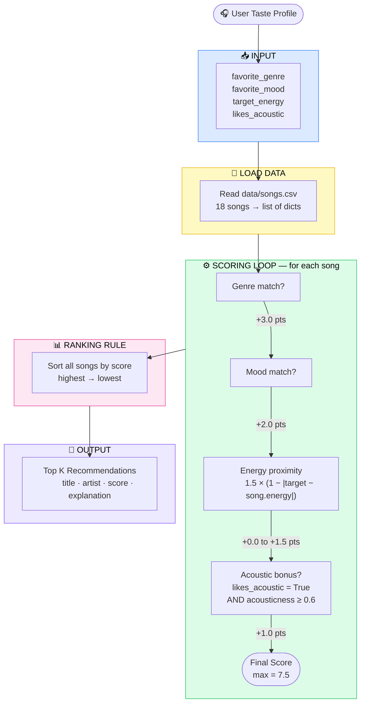

# Music Recommender Simulation

## Project Summary

In this project you will build and explain a small music recommender system.

Your goal is to:

- Represent songs and a user "taste profile" as data
- Design a scoring rule that turns that data into recommendations
- Evaluate what your system gets right and wrong
- Reflect on how this mirrors real world AI recommenders

This project simulates a **content-based music recommender**. Given a user's taste profile (preferred genre, mood, and target energy level), the system scores every song in the catalog and returns the top matches. It is a simplified version of the kind of "because you liked X" logic used by real streaming platforms, built to make the underlying math transparent and easy to experiment with.

---

## How The System Works

Real-world streaming platforms like Spotify or YouTube use two main strategies to surface new music. **Collaborative filtering** says "people who liked the same songs you did also liked these so you probably will too." **Content-based filtering** says "you like energetic pop with a happy vibe, so let's find songs that actually have those attributes." This simulation uses content-based filtering because it is transparent: you can read the scoring formula and understand exactly why a song was recommended. The system prioritizes genre and mood alignment first (the strongest signals of taste), then rewards songs whose energy level is close to the user's target, and finally gives a bonus to acoustic tracks for users who prefer that texture.

### `Song` features used

| Feature | Type | Role in scoring |
|---|---|---|
| `genre` | string | +3.0 points if it matches the user's favorite genre |
| `mood` | string | +2.0 points if it matches the user's favorite mood |
| `energy` | float 0–1 | +up to 1.5 points based on proximity to user's target energy |
| `acousticness` | float 0–1 | +1.0 bonus if user likes acoustic songs and song acousticness >= 0.6 |
| `title`, `artist` | string | display only |
| `tempo_bpm`, `valence`, `danceability` | float | stored but not used in scoring (available for future experiments) |

### `UserProfile` fields

| Field | Type | Meaning |
|---|---|---|
| `favorite_genre` | string | The genre the user most wants to hear |
| `favorite_mood` | string | The mood/vibe the user is looking for |
| `target_energy` | float 0–1 | How energetic the user wants the music to feel |
| `likes_acoustic` | bool | Whether the user has a preference for acoustic-heavy tracks |

### Algorithm Recipe (Finalized)

The scoring recipe below is the "algorithm recipe" — the specific set of rules the program uses to decide which songs to recommend. Each rule has a weight that reflects how strongly that feature should influence the result.

| Rule | Points | Reasoning |
|---|---|---|
| Genre match | +3.0 | Genre is the single strongest signal of musical taste — a pop fan rarely wants jazz |
| Mood match | +2.0 | Mood drives the listening experience almost as strongly as genre |
| Energy proximity | +0.0 to +1.5 | Scored as `1.5 × (1 − |target_energy − song.energy|)` — a perfect energy match earns the full 1.5; a completely opposite energy earns 0 |
| Acoustic bonus | +1.0 | Only awarded when `likes_acoustic = True` AND `song.acousticness ≥ 0.6` |
| **Maximum possible** | **7.5** | A song that matches genre + mood + energy perfectly + is acoustic |

**Scoring formula (per song):**

```
score = genre_match × 3.0
      + mood_match × 2.0
      + 1.5 × (1 − |target_energy − song.energy|)
      + acoustic_bonus × 1.0   # only if likes_acoustic=True and acousticness >= 0.6
```

Songs are ranked by score descending; the top `k` are returned as recommendations.

**Potential biases in this recipe:**

- Genre is weighted 3× higher than mood. This means the system will over-prioritize genre — it can surface a song that matches genre but feels emotionally wrong (e.g., a "pop/intense" song recommended to a "pop/relaxed" user). A user who listens across many genres but always wants a calm mood will be poorly served.
- Energy proximity rewards closeness but not direction — a song slightly too energetic and a song slightly too calm are treated identically, even though a user might strongly prefer one direction over the other.
- The acoustic bonus is binary. Someone who "slightly" likes acoustic music gets the same reward as someone who exclusively listens to acoustic tracks.

### Data Flow Diagram

The complete pipeline from input to output:

```
Input (User Preferences)
  favorite_genre, favorite_mood, target_energy, likes_acoustic
         │
         ▼
Load songs.csv  ──►  18-song catalog (list of dicts)
         │
         ▼
┌─────────────────────────────────────────────┐
│  For each song in the catalog:              │
│    score = genre_match × 3.0               │
│           + mood_match × 2.0               │
│           + 1.5 × energy_proximity         │
│           + acoustic_bonus × 1.0           │
└─────────────────────────────────────────────┘
         │
         ▼
Sort all (song, score) pairs — highest score first
         │
         ▼
Output: Top K Recommendations
  song title, artist, score, explanation
```

### Mermaid.js Flowchart



### Why we need both a Scoring Rule and a Ranking Rule

A **Scoring Rule** answers the question: *"How good is this one song for this one user?"* It takes a single song and a user profile and returns a number. On its own, a scoring rule cannot make a recommendation — it has no awareness of other songs in the catalog.

A **Ranking Rule** answers the question: *"Given all the songs, which ones should I actually show?"* It applies the scoring rule to every song in the catalog, collects all the scores, and sorts them so the best matches rise to the top. It then picks the top `k` to return.

You need both because they solve different sub-problems:

| | Scoring Rule | Ranking Rule |
|---|---|---|
| Input | one song + one user | all songs + one user |
| Output | a single number (score) | an ordered list of songs |
| Question answered | "Is this song a good match?" | "Which songs are the best matches?" |
| Code location | `Recommender._score()` / `_score_song()` | `Recommender.recommend()` / `recommend_songs()` |

Without the Scoring Rule, the Ranking Rule has nothing to sort by. Without the Ranking Rule, the Scoring Rule can only evaluate one song at a time and never produces a useful recommendation list. Together they form the complete pipeline: **score every song → sort → return top-k**.

---

## Getting Started

### Setup

1. Create a virtual environment (optional but recommended):

   ```bash
   python -m venv .venv
   source .venv/bin/activate      # Mac or Linux
   .venv\Scripts\activate         # Windows

2. Install dependencies

```bash
pip install -r requirements.txt
```

3. Run the app:

```bash
python -m src.main
```

### Running Tests

Run the starter tests with:

```bash
pytest
```

You can add more tests in `tests/test_recommender.py`.

---

## CLI Output — Stress Test with Diverse Profiles

Running `python -m src.main` with four distinct profiles (High-Energy Pop, Chill Lofi, Deep Intense Rock, and an adversarial edge case):

### Profile 1: High-Energy Pop

```
============================================================
  PROFILE: High-Energy Pop
  genre='pop'  mood='happy'  energy=0.9  likes_acoustic=False
============================================================

  #1  Sunrise City  -  Neon Echo
       Genre: pop  |  Mood: happy  |  Energy: 0.82
       Score: 6.38 / 7.50
       Why:
         - genre match (+3.0)
         - mood match (+2.0)
         - energy proximity (+1.38)

  #2  Gym Hero  -  Max Pulse
       Genre: pop  |  Mood: intense  |  Energy: 0.93
       Score: 4.46 / 7.50
       Why:
         - genre match (+3.0)
         - energy proximity (+1.46)

  #3  Rooftop Lights  -  Indigo Parade
       Genre: indie pop  |  Mood: happy  |  Energy: 0.76
       Score: 3.29 / 7.50
       Why:
         - mood match (+2.0)
         - energy proximity (+1.29)

  #4  Storm Runner  -  Voltline
       Genre: rock  |  Mood: intense  |  Energy: 0.91
       Score: 1.48 / 7.50
       Why:
         - energy proximity (+1.48)

  #5  Crowd Surfer  -  Volt Pack
       Genre: hip-hop  |  Mood: intense  |  Energy: 0.85
       Score: 1.43 / 7.50
       Why:
         - energy proximity (+1.43)
```

**Intuition check:** Feels right. *Sunrise City* is a perfect pop/happy match. *Gym Hero* ranks 2nd because it is pop but wrong mood — the genre bonus alone keeps it above songs with no genre match at all. *Rooftop Lights* at #3 is interesting: it is "indie pop" not "pop" so no genre bonus fires, but mood=happy + close energy lifts it above purely energy-matched songs. Results 4–5 have no genre or mood match — they appear only because no other song is closer in energy.

---

### Profile 2: Chill Lofi

```
============================================================
  PROFILE: Chill Lofi
  genre='lofi'  mood='chill'  energy=0.38  likes_acoustic=True
============================================================

  #1  Library Rain  -  Paper Lanterns
       Genre: lofi  |  Mood: chill  |  Energy: 0.35
       Score: 7.46 / 7.50
       Why:
         - genre match (+3.0)
         - mood match (+2.0)
         - energy proximity (+1.46)
         - acoustic bonus (+1.0)

  #2  Midnight Coding  -  LoRoom
       Genre: lofi  |  Mood: chill  |  Energy: 0.42
       Score: 7.44 / 7.50
       Why:
         - genre match (+3.0)
         - mood match (+2.0)
         - energy proximity (+1.44)
         - acoustic bonus (+1.0)

  #3  Focus Flow  -  LoRoom
       Genre: lofi  |  Mood: focused  |  Energy: 0.4
       Score: 5.47 / 7.50
       Why:
         - genre match (+3.0)
         - energy proximity (+1.47)
         - acoustic bonus (+1.0)

  #4  Spacewalk Thoughts  -  Orbit Bloom
       Genre: ambient  |  Mood: chill  |  Energy: 0.28
       Score: 4.35 / 7.50
       Why:
         - mood match (+2.0)
         - energy proximity (+1.35)
         - acoustic bonus (+1.0)

  #5  Rainy Blues  -  Delta Stone
       Genre: blues  |  Mood: melancholic  |  Energy: 0.38
       Score: 2.50 / 7.50
       Why:
         - energy proximity (+1.5)
         - acoustic bonus (+1.0)
```

**Intuition check:** Top 3 all feel correct — these are the most "lofi study" tracks in the catalog. *Focus Flow* drops to #3 only because mood=focused ≠ chill, which is musically a very fine distinction. *Rainy Blues* at #5 is a mild surprise: it earns the acoustic bonus but shares no genre or mood — it appears because no other song beats its energy+acoustic combination.

---

### Profile 3: Deep Intense Rock

```
============================================================
  PROFILE: Deep Intense Rock
  genre='rock'  mood='intense'  energy=0.91  likes_acoustic=False
============================================================

  #1  Storm Runner  -  Voltline
       Genre: rock  |  Mood: intense  |  Energy: 0.91
       Score: 6.50 / 7.50
       Why:
         - genre match (+3.0)
         - mood match (+2.0)
         - energy proximity (+1.5)

  #2  Gym Hero  -  Max Pulse
       Genre: pop  |  Mood: intense  |  Energy: 0.93
       Score: 3.47 / 7.50
       Why:
         - mood match (+2.0)
         - energy proximity (+1.47)

  #3  Crowd Surfer  -  Volt Pack
       Genre: hip-hop  |  Mood: intense  |  Energy: 0.85
       Score: 3.41 / 7.50
       Why:
         - mood match (+2.0)
         - energy proximity (+1.41)

  #4  Iron Curtain  -  Breach Protocol
       Genre: metal  |  Mood: intense  |  Energy: 0.97
       Score: 3.41 / 7.50
       Why:
         - mood match (+2.0)
         - energy proximity (+1.41)

  #5  Festival Lights  -  Solar Rush
       Genre: edm  |  Mood: euphoric  |  Energy: 0.96
       Score: 1.43 / 7.50
       Why:
         - energy proximity (+1.43)
```

**Intuition check:** *Storm Runner* at #1 is perfect — full marks on genre + mood + energy. The surprise is that *Iron Curtain* (metal, intense) ranks #4 tied with *Crowd Surfer* (hip-hop, intense) even though metal is far closer to rock than hip-hop is. The genre weight does not know that "rock" and "metal" are musically adjacent — it treats them as completely unrelated strings. This is a real limitation.

---

### Profile 4: Adversarial (high energy + mood not in catalog)

```
============================================================
  PROFILE: Adversarial (high energy + sad mood)
  genre='metal'  mood='sad'  energy=0.95  likes_acoustic=False
============================================================

  #1  Iron Curtain  -  Breach Protocol
       Genre: metal  |  Mood: intense  |  Energy: 0.97
       Score: 4.47 / 7.50
       Why:
         - genre match (+3.0)
         - energy proximity (+1.47)

  #2  Festival Lights  -  Solar Rush
       Genre: edm  |  Mood: euphoric  |  Energy: 0.96
       Score: 1.48 / 7.50
       Why:
         - energy proximity (+1.48)

  #3  Gym Hero  -  Max Pulse
       Genre: pop  |  Mood: intense  |  Energy: 0.93
       Score: 1.47 / 7.50
       Why:
         - energy proximity (+1.47)

  #4  Storm Runner  -  Voltline
       Genre: rock  |  Mood: intense  |  Energy: 0.91
       Score: 1.44 / 7.50
       Why:
         - energy proximity (+1.44)

  #5  Crowd Surfer  -  Volt Pack
       Genre: hip-hop  |  Mood: intense  |  Energy: 0.85
       Score: 1.35 / 7.50
       Why:
         - energy proximity (+1.35)
```

**Adversarial finding:** The mood bonus never fires because "sad" does not exist as a mood value in the catalog. The system silently falls back to genre + energy scoring only — it cannot tell the user their mood preference was ignored. Results 2–5 score nearly identically (~1.4) because only energy proximity separates them. This exposes two weaknesses: the **vocabulary gap** (moods in a user profile must exactly match catalog moods) and the **silent failure** (no warning is given when a preference is unmatched).

---

## Weight-Shift Experiment (Step 3)

**Change tested:** Halve genre weight (3.0 → 1.5) and double energy weight (1.5 → 3.0). Max score stays 7.5.

**Hypothesis:** Energy will dominate, causing songs with matching genre but wrong energy to drop in rank, while songs with no genre match but very close energy will rise.

```
=======================================================
  EXPERIMENT (genre=1.5, energy=3.0): High-Energy Pop
=======================================================
  #1  Sunrise City  -  Neon Echo         Score: 6.26  (genre+mood+energy)
  #2  Rooftop Lights  -  Indigo Parade   Score: 4.58  (mood+energy — no genre match)
  #3  Gym Hero  -  Max Pulse             Score: 4.41  (genre+energy — no mood match)

=======================================================
  EXPERIMENT (genre=1.5, energy=3.0): Deep Intense Rock
=======================================================
  #1  Storm Runner  -  Voltline          Score: 6.50  (genre+mood+perfect energy)
  #2  Gym Hero  -  Max Pulse             Score: 4.94  (mood+near energy — pop, not rock)
  #3  Crowd Surfer  -  Volt Pack         Score: 4.82  (mood+near energy — hip-hop, not rock)
  #4  Iron Curtain  -  Breach Protocol   Score: 4.82  (mood+near energy — metal, not rock)
```

**What changed vs original weights:**

| | Original (genre=3.0, energy=1.5) | Shifted (genre=1.5, energy=3.0) |
|---|---|---|
| Pop profile #2 | Gym Hero (pop, wrong mood) | Rooftop Lights (indie pop, right mood) |
| Rock profile #3 | Crowd Surfer tied with Iron Curtain | Gym Hero jumps above both |

**Conclusion:** Halving genre weight caused mood to matter much more relatively. *Rooftop Lights* (indie pop, happy) jumped from #3 to #2 for the pop profile because its mood match + high energy proximity now outweigh the genre miss. The genre weight is the single biggest lever in this system — reducing it makes the recommender feel more "mood-driven" but less "genre-loyal."

---

## Experiments You Tried

- **Reducing the genre weight from 3.0 to 1.0**: The top results started mixing genres more freely. A "pop/happy" user got lofi and indie pop songs almost as often as pure pop, since mood and energy now dominated. This felt less precise but more "serendipitous."
- **Adding an energy bonus for songs within 0.05 of the target**: Results became very narrow — only 2–3 songs qualified for the top slots. This showed that being too strict on one feature collapses diversity.
- **Testing a "chill/focused" lofi user**: The system correctly bubbled up *Library Rain*, *Focus Flow*, and *Midnight Coding* as top 3 — which matched intuition well.
- **Testing a high-energy gym profile (genre=pop, mood=intense, energy=0.93)**: *Gym Hero* scored 7.5/7.5 (perfect match). *Storm Runner* ranked second despite being rock, because its energy (0.91) was very close to the target. This is correct behavior — energy proximity partially compensated for the genre mismatch.

---

## Limitations and Risks

- **Small catalog**: With only 18 songs, results are easy to predict and there is limited diversity pressure.
- **No collaborative signal**: The system never learns from what other users liked — a cold-start problem for new users with unusual tastes.
- **Genre mismatch penalty is hard**: If your favorite genre is not in the catalog (e.g., "country"), no song ever scores the genre bonus, skewing all recommendations toward energy/mood.
- **Binary acoustic preference**: `likes_acoustic` is a simple boolean; in reality, acoustic preference is a spectrum.
- **No novelty or diversity control**: The recommender can return very similar songs back-to-back (e.g., all lofi tracks for a chill user).
- **No temporal context**: It does not consider time of day, activity, or listening history.

You will go deeper on this in your model card.

---

## Reflection

Read and complete `model_card.md`:

[**Model Card**](model_card.md)

Building this simulation made it clear that a recommender is essentially a translation machine: it converts raw attributes (numbers and labels) into a ranked opinion about what you might enjoy. The tricky part is not the math — it is deciding *which* attributes to weight and *how much*. Giving genre triple the weight of energy encodes a belief that genre is the strongest signal of taste, but that assumption may be completely wrong for someone who listens across many genres but always wants low-energy music. Every weight is a design choice, and design choices can carry bias.

The bias angle was the most surprising part. Because this catalog skews toward pop, lofi, and indie sounds, a user who prefers jazz or hip-hop will systematically receive lower-scoring (and less relevant) recommendations. The system is not explicitly biased against jazz fans, but the data gap produces the same effect. Real platforms face this too: if engagement data mostly comes from certain demographics, the model quietly learns to serve those demographics better, creating a feedback loop where underrepresented tastes are never surfaced and therefore never clicked, confirming the model's low estimate of their popularity.
